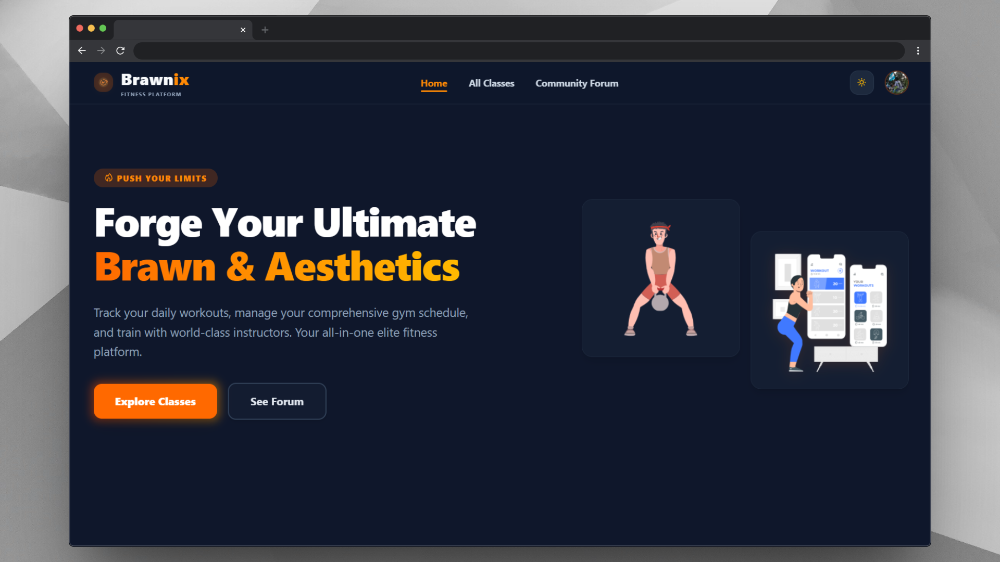

# Brawnix

**A role-based fitness platform where users book classes, trainers run them, and
admins manage the platform.**

**[🔗 Live Demo](https://brawnix.vercel.app)** &nbsp;·&nbsp;
**[⚙️ Backend Repo](https://github.com/tawchifulislam/brawnix-server)**

---

## 🎯 Key Features

### 👤 User

- Browse and search classes by category
- Book classes with secure Stripe payments
- Manage and cancel bookings
- Save favorite classes
- Apply to become a trainer
- Forum: post, comment, like/dislike

### 🏋️ Trainer

- Submit new classes for admin approval
- Edit or remove existing classes
- View students enrolled in each class
- Publish and manage forum posts

### 🛠️ Admin

- Approve or reject submitted classes
- Promote or demote users, block or unblock accounts
- Moderate all forum posts
- Review trainer applications
- Analytics dashboard for roles and approvals (Recharts)

### 🌐 Platform

- Role-based authentication and route protection
- Light and dark mode
- Fully responsive design

---

## 📦 npm Packages Used

